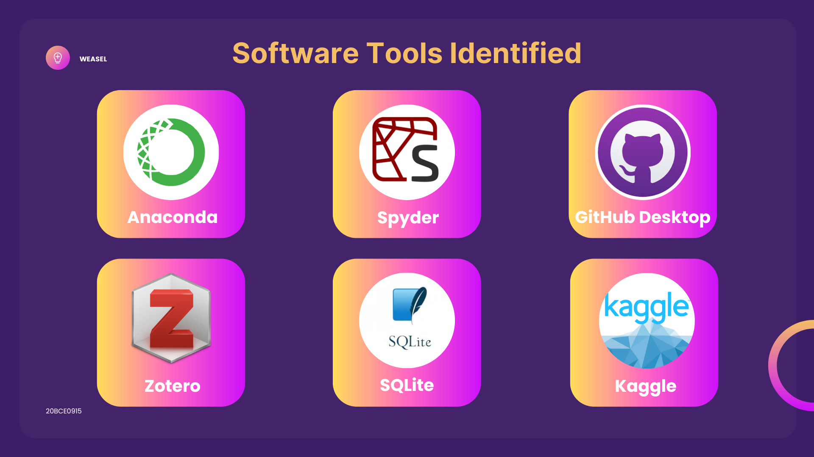

**Name :** Raghul.S <br>
**Reg.no :** 20BCE0915<br>
**Course code :** CSE1901<br>
**Class Nbr :** VL2022230505138<br>
**Faculty Name :** Manoov R <br>

# **Review - 1** : **Skill-based Career Recommendation System**

## **Abstract**

According to a recent study, most college
graduates find it challenging to choose their career
field. A lot of engineers are working to make IT the
dominant discipline. Therefore, they are doing
various online courses and aimlessly looking for
employment. Many students today are interested
in careers in the IT industry, but they are unsure of
which field is best for them. To avoid this situation
candidates, need a Job recommendation that
analyses the skills to recommend a suitable job for
the candidate. The solution is to design a system
that reads a resume and their skills.


<br>

## **Introduction**

A student may find it challenging to choose the correct job route because they are going
through a number of different stages at this time, including peer pressure and parental
pressure. Therefore, a model that directs the student based on his or her profile and skill ratings
can be designed to assist pupils in such situations. An algorithm can be used to pull special
characteristics from the profile and forecast both the best career option and the career options
one should avoid choosing. This will enable the learner to succeed in the area where he or she
is most talented.

This skill-based career recommendation system focuses on predicting the suitable jobs for the
candidates. It uses machine learning models to find similarities between jobs description and
resumes to predict accurately. This application can be used by any candidates who need or
who want to know about their suitable jobs and to improve themselves with both soft skills and
hard skills. It will be helpful to them by not wasting their time searching for jobs. They can also
grow their skills in their domain and grow faster in their domain.

<br>

## **Software Tools Identified**

* **Anaconda** <br> Anaconda is a distribution of the Python and R programming languages for scientific computing that aims to simplify package management and deployment.

* **Spyder** <br>Spyder is an open-source cross-platform integrated development environment (IDE) for scientific programming in the Python language that integrates with a number of prominent packages in the scientific Python stack, including NumPy, SciPy, Matplotlib, pandas, IPython, SymPy and Cython, as well as other open-source software.

* **Github Desktop** <br> GitHub, Inc is an Internet hosting service that provides the distributed version control of Git plus access control, bug tracking, software feature requests, task management, continuous integration, and wikis for every project.

* **Zotero** <br> Zotero is a free and open-source reference management software to manage bibliographic data and related research materials, such as PDF files. Features include web browser integration, online syncing, generation of in-text citations, footnotes, and bibliographies, an integrated PDF reader and note editor, as well as integration with the word processors Microsoft Word, LibreOffice Writer, and Google Docs. 

* **SQLite** <br> SQLite is a database engine written in the C programming language. It is not a standalone app; rather, it is a library that software developers embed in their apps. As such, it belongs to the family of embedded databases.

* **Kaggle** <br> Kaggle is a data science community with tools and resources which include externally contributed machine learning
datasets of all kinds. Kaggle allows users to find and publish data sets, explore and build models in a web-based data-science environment, work with other data scientists and machine learning engineers, and enter competitions to solve data science challenges.

* **Zettlr** <br> Zettlr is a markdown editor for writing articles, ebooks, and other types of content across platforms. It is
modelled after the personal knowledge management and note-taking Zettelkasten system. It supports
presentations (using the reveal.js framework), autocorrection, snippets, localization, math formulae, citations,
and custom templates.



### **Python Libraries**

* **Numpy** <br> NumPy is a library for the Python programming language, adding support for large, multi-dimensional arrays and matrices, along with a large collection of high-level mathematical functions to operate on these arrays.

* **Flask** <br> Flask (source code) is a Python web framework built with a small core and easy-to-extend philosophy.

* **Django** <br> Django  is a free and open-source, Python-based web framework that follows the model–template–views (MTV) architectural pattern.

* **Matplotlib** <br> Matplotlib is a plotting library for the Python programming language and its numerical mathematics extension NumPy. It provides an object-oriented API for embedding plots into applications using general-purpose GUI toolkits like Tkinter, wxPython, Qt, or GTK. 

* **Scikit-learn** <br> scikit-learn is a free software machine learning library for the Python programming language that features various classification, regression and clustering algorithms including support-vector machines, random forests, gradient boosting, k-means and DBSCAN, and is designed to interoperate with the Python numerical and scientific libraries NumPy and SciPy. 

* **Pandas** <br> pandas is a software library written for the Python programming language for data manipulation and analysis that offers data structures and operations for manipulating numerical tables and time series. 


<br>

## **Project Work Breakdown**

### **1. Initial Planning & Project Proposal**

#### **1.1 Project Scope**

Determine the project goals & objectives, project deliverables, project constraints,
assumptions and project milestones.

#### **1.2 Work Breakdown Structure**

Construct a heirarchial decomposition of the project into phases, deliverables, and work
packages.

### **2. Evaluate Project Ideas**

#### **2.1 Literature Review**

Create an overview of the previously published works on the topic.

#### **2.2 Evaluate Datesets**

Assess various datasets and find a dataset which meets the criteria outlined in the assessment.

#### **2.3 Evaluate Machine Learning Methods**

Train, test and validate different algorithms based on a set of metrics such as classification
accuracy, logarithmic loss, F1 score, confusion matrix etc.

### **3. Preparing Project Environment**

#### **3.1 Selecting ML Platform**

Evalute various ML platforms and choose the most suitable one.

#### **3.2 Installing Python and IDE**

Installing Anaconda Python distribution and Spyder IDE.

#### **3.3 Installing Advanced Python Modules**

Install various python modules like numpPy, Django, Flask , Matplotlib and pandas which are
related to the project.

### **4. Machine Learning Model**

#### **4.1 Build ML Model**

* Contextualise machine learning.
* Explore the data and choose the type of algorithm
* Prepare and clean the dataset
* Split the prepared dataset and perform cross validation
* Perform machine learning optimisation
* Deploy the model

#### **4.2 Data Pre-Processing**

* **Import libraries** <br>
  Importing python libraries required for data pre-processing:
   ```python
   import pandas as pd
   import numpy as np
   import matplotlib.pyplot as plt
   import seaborn as sns
    ```
* **Load the data** <br>
  Importing the required CSV file into Python using Pandas:
  ```python
  df = pd.read_csv('./data/mldata.csv')
  print("\nList of Numerical features: \n" , df.select_dtypes(include=np.number).columns.tolist())
  print("\nList of Categorical features: \n" , df.select_dtypes(include=['object']).columns.tolist())
  ```
  **List of Numerical features:** <br>
 ['Logical quotient rating', 'hackathons', 'coding skills rating', 'public speaking points']

  **List of Categorical features:** <br>
  ['self-learning capability?', 'Extra-courses did', 'certifications', 'workshops', 'reading and writing skills', 'memory capability score', 'Interested subjects', 'interested career area ', 'Type of company want to settle in?', 'Taken inputs from seniors or elders', 'Interested Type of Books', 'Management or Technical', 'hard/smart worker', 'worked in teams ever?', 'Introvert', 'Suggested Job Role']
  
* **Checking Missing Values** <br>
  In order to check null values in Pandas DataFrame, we use isnull() function this function return dataframe of Boolean values which are True for NaN values.
  ```python
  df.isnull().sum(axis=0)
  ```
  
* **Checking Distinct Values for Categorical Features**

  ```python
  categorical_col = df[df.select_dtypes(include=['object']).columns.tolist()];
     
  for i in categorical_col:
    print(df[i].value_counts(), end="\n\n")
  ```
  
* Checking Data Balancing for Classification
* Binary Encoding for Categorical Variables
* NumDummy Variable Encodingber Encoding for Categorical

#### **4.3 Train Model**

* Tune hyperparamaters of the training alogorithm based on theoretical deductions.
* Scale the numerical data down to a scale from zero to one (Batch Normalization).

#### **4.4 Test Model**

* Once the model has been trained, performance is gauged according to a confusion matrix and precision/accuracy metrics.

### **5. Software Integration & testing**

* Design user interface
* Develop an Web Application for the user interface
* Integrate frontend and backend
* Perform different types of software testing (System Testing, Acceptance Testing, Smoke
Testing, Regression Testing, Performance Testing, Security Testing) on all features of the WebApp.
* Deploy and test the webApp in different environments.

### **6. Consulation From Mentor**

* Review 1
* Review 2
* Review 3

### **7. Results and Final Poject Submission**
* Present results
* Reflection
* Conclusion
* Creating Final Review Document
* Creating Supporting Documents

## **References**

* [Qing Wan, Lin Ye, "Career Recommendation for College Students Based on Deep Learning and Machine Learning", Scientific Programming, vol. 2022, Article ID 3437139, 10 pages, 2022. https://doi.org/10.1155/2022/3437139](https://www.hindawi.com/journals/sp/2022/3437139/)

* [Ong, Xiang & Lim, Kwan. (2023). SkillRec: A Data-Driven Approach to Job Skill Recommendation for Career Insights. 10.48550/arXiv.2302.09938. ](https://www.researchgate.net/publication/368664292_SkillRec_A_Data-Driven_Approach_to_Job_Skill_Recommendation_for_Career_Insights)

* [G.Mahalakshmi, A.Arun Kumar , B.Senthilnayaki, J.Duraimurugan, "Job Recommendation
System Based on Skill Sets"](https://ijcrt.org/papers/IJCRT2208099.pdf)

* [A. Ghosh, B. Woolf, S. Zilberstein and A. Lan, "Skill-based Career Path Modeling and Recommendation," 2020 IEEE International Conference on Big Data (Big Data), Atlanta, GA, USA, 2020, pp. 1156-1165, doi: 10.1109/BigData50022.2020.9377992.](https://ieeexplore.ieee.org/document/9377992)
