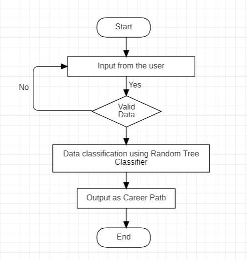
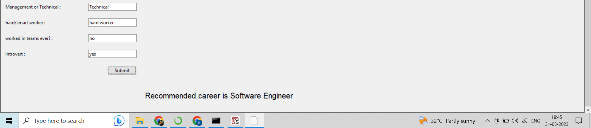
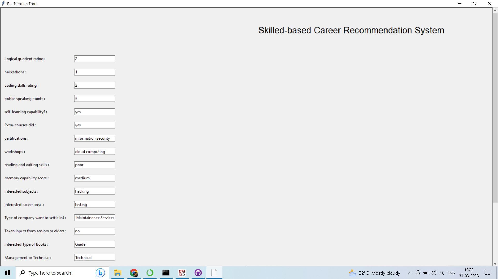

**Name :** Raghul.S <br>
**Reg.no :** 20BCE0915<br>
**Course code :** CSE1901<br>
**Class Nbr :** VL2022230505138<br>
**Faculty Name :** Manoov R <br>

# **Review - 2** : **Skill-based Career Recommendation System**

<br>

## **Literature Review**

### **Introduction**

Previously, the questionnaire method was used to forecast a student's career. However, it is a time-consuming process, and it is difficult to determine the status of students' opinions. Various computing techniques are used to forecast the student's future career. In this literature review, we aim to synthesize existing research on skill-based career recommendation systems. We will also compare the accuracy of various ML algorithms such as SVM (Scalar Vector Machine), RF (Random Forest), XGB (XGBClassifier ), DT(Decision Tree) and Linear Regression.

### **Existing System**

There are multiple models available in the market to address the same problem, each with its own advantages and disadvantages. Some existing systems use these methods as input.

* **Forecasting using Academic Grades**
Using student academic grades [1,2] as input for forecasting may not be efficient as individual grades depend on factors such as college, exam models, paper evaluation, and so on.

* **Forecasting using YES/NO Questionnaire**
Asking a questionnaire with various required fields and receiving a yes/no answer may confuse students. For instance, in a particular course, a student may only have basic knowledge, and hence, not know whether to answer yes or no. In such cases, the student might not provide input, leading to incorrect predictions.

* **Lack of Clear Career Roadmap for Forecasting**
Predicting a career without providing a clear roadmap on how to proceed may leave students in a dilemma. Predictions with a clear roadmap can help students understand their career path.

### **Proposed System**

#### **Flow chart**



#### **Data Collection**

Questioning students and receiving responses in the form of yes or no may not provide accurate data for predicting a student's career path. To accurately predict a student's career, many parameters such as knowledge in different subjects, specializations, programming skills, hackathons, workshops, certifications, and preferred courses are required. To train a model for this purpose, a dataset with over 6,500 records that includes all necessary fields has been collected. The input data is obtained in the form of ratings for various fields of computer science students. Asking students to rate themselves in required fields is the best way to get precise knowledge about their abilities.

#### **Data Pre-Processing**

#### **Importing libraries and loading data** <br>

Importing python libraries required for data pre-processing and loading the required CSV file using pandas library

  ```python
    import pandas as pd
    import numpy as np
    import matplotlib.pyplot as plt
    import seaborn as sns
    df = data.read_csv('./data/mldata.csv')
    print("Columns in our dataset:\n" , df.columns)
  ```
   **Columns in our dataset:** <br> Index(['Logical quotient rating', 'hackathons', 'coding skills rating',
       'public speaking points', 'self-learning capability?',
       'Extra-courses did', 'certifications', 'workshops',
       'reading and writing skills', 'memory capability score',
       'Interested subjects', 'interested career area ',
       'Type of company want to settle in?',
       'Taken inputs from seniors or elders', 'Interested Type of Books',
       'Management or Technical', 'hard/smart worker', 'worked in teams ever?',
       'Introvert', 'Suggested Job Role'],
      dtype='object')
      
#### **Finding numerical and categorical features**
  ```python
  print("\nList of Numerical features: \n" , data.select_dtypes(include=np.number).columns.tolist())
  print("\nList of Categorical features: \n" , data.select_dtypes(include=['object']).columns.tolist())
  ```
  List of Numerical features: <br>
 ['Logical quotient rating', 'hackathons', 'coding skills rating', 'public speaking points']

  List of Categorical features: <br>
  ['self-learning capability?', 'Extra-courses did', 'certifications', 'workshops', 'reading and writing skills', 'memory capability score', 'Interested subjects', 'interested career area ', 'Type of company want to settle in?', 'Taken inputs from seniors or elders', 'Interested Type of Books', 'Management or Technical', 'hard/smart worker', 'worked in teams ever?', 'Introvert', 'Suggested Job Role']
  
#### **Checking missing values**<br>
  In order to check null values in Pandas DataFrame, we use isnull() function this function return dataframe of Boolean values which are True for NaN values.
   ```python
  df.isnull().sum(axis=0)
  ```

#### **Dummy value encoding** <br>
Dummy variable encoding, also known as one-hot encoding, is a technique used in data analysis and machine learning to convert categorical data into numerical data that can be used in statistical and machine learning models.

Using this technique, we avoid having the model interpret the categorical variable as a continuous variable with an inherent order (which may not exist) and instead allow it to treat each category independently. 
  ```python
  for i in data[categorical_cols]:
    data[i] = data[i].astype('category')
    data[i + "_code"] = data[i].cat.codes
    data= data.drop(i, axis=1)
  ```
#### **Splitting the dataset** <br>
Splitting the dataset is the process of dividing a given dataset into two or more subsets for training and testing purposes in machine learning or data analysis. Here, the dataset is divided into two parts: the training set and the test set. The training set is used to build the machine learning model, while the test set is used to evaluate the performance of the model on new, unseen data.
  ```python
  from sklearn.model_selection import train_test_split

  X=data.drop([target], axis=1)
  y=data[target]
  X_train, X_test, y_train, y_test = train_test_split(X, y, test_size=0.2)
  ```
#### **Feature Scaling** <br>
Feature scaling is the process of transforming numerical data in a dataset to a common scale, without distorting differences in the ranges of values. This can help improve the performance and accuracy of machine learning algorithms that are sensitive to the scale of the input features. It involves converting the values of the features in a dataset so that they all fall within a similar range, typically between 0 and 1 or -1 and 1, making them easier to compare and analyze. This can be achieved using various techniques such as normalization, standardization, or rescaling.
  ```python
  from sklearn.preprocessing import StandardScaler
  
  X_train_s = scaler.fit_transform(X_train)
  X_test_s = scaler.transform(X_test)
  ```

#### **Algorithms used**

#### **Decision Tree**

The decision tree is a basic machine learning technique that can be used for regression tasks. It is structured like a flow-chart, with each non-leaf node representing a test on an attribute and each branch representing the test's outcome. The leaf nodes contain class labels, and the topmost node is called the root node. This model is particularly effective for handling tabular data that has numerical or categorical features with a small number of categories (less than a few hundred). Different machine learning models have varying advantages depending on the situation.

The first step in creating a decision tree involves selecting the root value. Next, the Information Gain (IG) and entropy of each node must be computed before it is divided. Nodes with higher IG or lower entropy values are preferred for division. This process is repeated until there are no further options for division or the entropy value is low. Entropy is an important metric for evaluating the likelihood of information. IG is used to measure the decrease in entropy value before each division. 

To construct a decision tree, two types of entropy are computed using a frequency data table. The entropy value can be calculated using only one attribute in the frequency table, as shown in the following equation.

**$$E(S) = \sum_{i = 1}^{c} - p_{i}\log_{2}(p_{i})$$**

The Entropy value of frequency table is caculated by using two attributes as the following equation:

**$$E(T, X) = \sum_{c \in X}P(c)E(c)$$**

The IG value can be calculated by using the following equation.

**$$Gain(T, X) = Entropy(T) - Entropy(T, X)$$**

#### **Random Forest Classifier**

The Random Forest is a highly effective machine learning model for predictive analytics, widely used in the industry. It is an additive model that generates predictions by combining decisions from a series of base models. Specifically, this class of models can be represented as the sum of simple base models, where each base classifier is a simple decision tree. This technique, which involves using multiple models to improve predictive performance, is known as model ensembling. In the case of random forests, each base model is constructed independently using a different subsample of the data.

The RF approach can be explained as the following steps: 
1. For $b = 1$ to $B$:
  * Draw a bootstrap sample $Z^{*}$ of size $N$ from the training data.
  * Grow a random-forest tree $T_{b}$ to the bootstrapped data, by recursively repeating the following steps for each terminal node of
  the tree, until the minimum node size $n_{min}$ is reached.
    I. Select $m$ variables at random from the $p$ variables.
    II. Pick the best variable/split-point among the $m$.
    III. Split the node into two daughter nodes.
2. Output the ensemble of trees $(T_{b})_{1}^{B}$

To make a prediction at a new point x:
$$Regression: f_{rf}^{B}(x) = \frac{1}{B}{\sum_{b = 1}^{B}}{T_{b}(x)}$$
Let $C_{b}(x)$ be the class prediction of the bth random-forest tree. Then, $Classification: $$C_{rf}^{B}(x) = majority vote (C_{b})_{1}^{B}$$

## Literature Survey

| Study | Year | Methodology | Results |
|-------|------|-------------|---------|
| Student Future Prediction Using Machine Learning| 2019 | Linear Regression, Decision Tree Regression, Random Tree classifier |The system  will  help  student  used  to  predict  the suitable  course. The system can facilitate the students, as it will guide them to take appropriate decision while choosing the stream  as  his/her  career.|
| Career Prediction System | 2021 | XGBoost | Career Prediction System developed using machine learning is very effective in predicting correct career based on the student skills possessed in required fields. |
| Random Forests and Decision Trees | 2012 | Random Forests, Decision Trees | From the results, it can be concluded that the Random Forest achieves increased classification performance and yields results that are accurate and precise in the cases of large number of instances. These scenarios also cover the missing values problem in the datasets and thus besides accuracy, it also overcomes the over-fitting problem generated due to missing values in the datasets |
| Student Career Prediction Using Decision Tree and Random Forest Machine Learning Classifiers| 2020| Random Forest, Decision Tree | This research work forecast the undergraduate students’ career by using RF and DT machine learning classifier. The classifiers are implemented by using Python programming languages. Final output shows that Random Forest classifier produces better result than the Decision Tree classifier. |

## **Demonstration**
Input 1:


Ouput 1:


Input 2:


Ouput 2:

